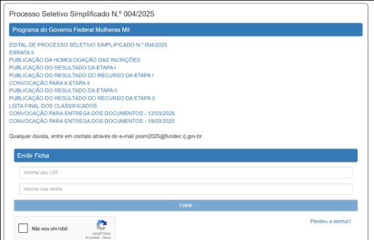

# Atividade avaliativa - Entrega 27/03 às 21:30 (Presencial)
    
> ### 🧩 Exercício: Criação de Página de Login para Processo Seletivo
Criar uma página HTML com estilo CSS que simule a interface de login do sistema de Processo Seletivo Simplificado (PSSM), incluindo:

Título e subtítulo

Lista de links com estilo

Formulário de login com CPF, senha e reCAPTCHA (simulado)

Botão de envio e link de recuperação de senha

Atividade no GitHub: https://github.com/PedroHammes/CCOMP/tree/main/Desenvolvimento%20de%20Aplica%C3%A7%C3%B5es%20Web/27-03-2025%20%5Bativ.%20aula%5D